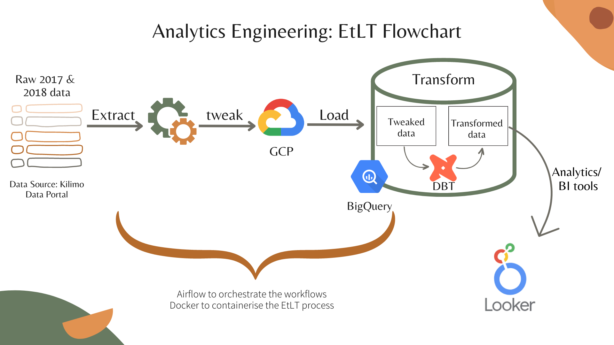

#  Data Pipeline using Airflow, GCP, BigQuery and DBT.

# Table of contents

- [Table of Contents](#Table-Of-Contents)
- [Project Summary](#project-summary)
- [Pipeline Workflow](#pipeline-workflow)
- [Prerequisites](#prerequisites)
- [Installation and Setup](#installation-and-setup)
- [Running Airflow](#running-airflow)

# Project Summary
 

The goal of this project is to develop a scalable data pipeline that **extracts**, **tweaks**, **loads**, and **transforms** Kenya's 2017 and 2018 Crop Production data by Counties from the [Kilimo Data Portal](http://kilimodata.org/dataset/kenya-maize-production-by-counties/resource/63fa57a5-a7c2-40e1-a728-f9546fa383ef) using Airflow, Google Cloud Platform (GCP), BigQuery and DBT.
While it would have been ideal to work with more recent data, the availability of local public datasets can sometimes limit our options. However, despite the data being a few years old, I believe it is still relevant to this project.

Key Components:

1. Airflow: Airflow will enable the creation and orchestration of the data pipeline by defining and executing workflows using Directed Acyclic Graphs (DAGs).

2. Docker: Docker will be used to containerize the Airflow environment, ensuring reproducible execution across different environments.

3. Google Cloud Platform (GCP): GCP will be used as the cloud infrastructure by providing services and resources that integrate seamlessly with Airflow and BigQuery, and facilitate data **storage** through Google Cloud Storage.

4. BigQuery: BigQuery, a **data warehouse** fully-managed by Google Cloud, will be the target storage and analytics platform. 

5. DBT (Data Build Tool): DBT is a SQL-based framework which will be used for data transformation and modeling, by connecting to our BigQuery data warehouse. Check out my [dbt_analytics repo](https://github.com/katenjoki/dbt_analytics/tree/master) to see how I created **data models** and **macros** to transform the data. 

# Pipeline Workflow

1. Data Extraction and "Tweaking": Airflow will orchestrate the extraction of Kenya's 2017 and 2018 Crop Production data by Counties, and slightly transform it into a suitable format for storing in GCP then loading into BigQuery.

2. Data Loading: Extracted data will be loaded into BigQuery, leveraging GCP's Cloud Storage.

3. Data Transformation: DBT will be used to transform and model the loaded data by defining SQL-based transformations, aggregations, and other manipulations to the data stored in our BigQuery warehouse.

To do this project, you have to setup your google cloud account. You can find steps and reference videos on how to do this in the [Terraform READme](airflow_gcp/GCP_Terraform/terraform/README.md).

# Prerequisites
Docker: Make sure you have Docker installed on your machine. You can download and install Docker from the official website: https://www.docker.com
You may need to set the memory for your Docker Engine to a minimum of 5GB otherwise if enough memory is not allocated, it might lead to airflow-webserver continuously restarting.

# Installation and Setup
1. Git clone the repo.
```
git clone https://github.com/katenjoki/analytics_eng_project.git
```
2. Rename your gcp-service-accounts-credentials file to google_production_credentials.json & store it in your $HOME directory. 
If you choose to rename it as something else e.g 'google_credentials.json', make sure this reflects on the docker-compose.yaml file as well, otherwise it won't run.
```
cd ~ && mkdir -p ~/.google/credentials/
mv <path/to/your/service-account-authkeys>.json ~/.google/credentials/google_production_credentials.json
```
3. Open the .env file and review/update the following environment variables: <br>
* To set/change the value of the AIRFLOW_UID variable to your user's UID (User ID) run the following command. For Windows, use MINGW/GitBash and execute the same command.
    ```
    echo -e "AIRFLOW_UID=$(id -u)" > .env
    ```

4. Edit the following in the environment section of the docker_compose.yaml file to reflect your project's details after [setting up your GCS infrastructure with Terraform](GCP_Terraform/terraform/README.md):

5. Navigate to the airflow folder.
```
cd airflow
```
6. Build the docker container
```
docker-compose build
```
7. Initialise airflow containers
```
docker-compose up airflow-init
```
8. Run the docker container
```
docker-compose up
```

# Running Airflow
Access the Airflow web interface (http://localhost:8080) and sign in with "airflow" as the username and the password. Please note that using these credentials is not recommended for production environments and only for demonstrative purposes.

Trigger the 'ingest_data_gcs_dag' by running the 'play' button on the action tab and monitor the DAG runs.

When the workflow runs successfully, this is what you should see:


Next, go to your Google Cloud console and select 'Cloud Storage' then 'Buckets'.
You should see the 'production_2017.parquet' and 'production_2018.parquet' in the 'raw/' folder.


To perform complex data analysis and generate insights, select 'BigQuery' in your Google Cloud console where you should see the loaded datasets as shown below.


If you're interested check out this repo where I [ingested data into local PostgreSQL using airflow and docker](https://github.com/katenjoki/postgresql_airflow/tree/master) using the same data.
